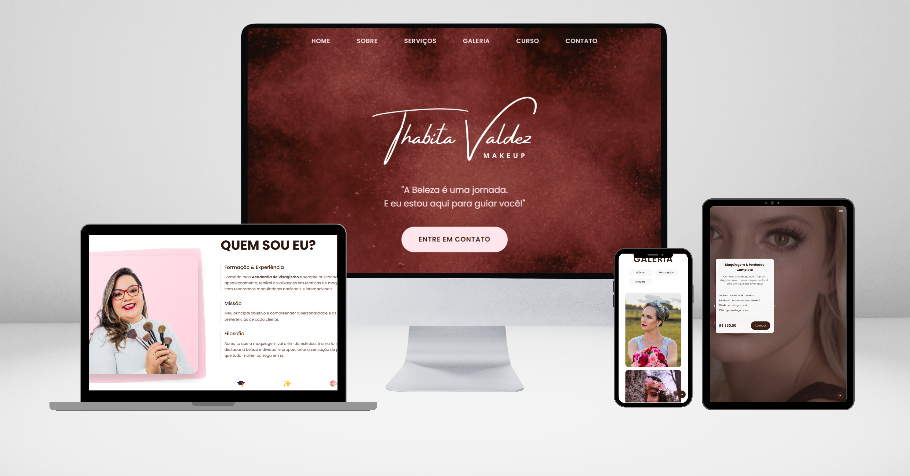

# Thabita Valdez Makeup Website

Website profissional desenvolvido para a maquiadora Thabita Valdez, apresentando seus serviços de maquiagem, curso profissionalizante e galeria de trabalhos. O site foi construído com foco em performance, acessibilidade e experiência do usuário.



## 🚀 Tecnologias Utilizadas

- HTML5
- CSS3 (com Flexbox e Grid)
- JavaScript (Vanilla ES6+)
- Responsive Design
- Mobile First Approach

## ⚙️ Funcionalidades

- **Menu Responsivo**: Menu hamburger para dispositivos móveis com animações suaves
- **Hero Section**: Background em vídeo com overlay e call-to-action
- **Slider de Serviços**: Carrossel interativo com auto-play e controles
- **Galeria Filtrada**: Galeria de imagens com filtros por categoria
- **Formulário de Contato**: Integração com WhatsApp
- **Seção de Curso**: Apresentação do curso profissionalizante
- **Layout Responsivo**: Adaptação para todos os tamanhos de tela
- **Botão "Voltar ao Topo"**: Navegação facilitada em páginas longas

## 🎨 Design

- **Cores Principais**:
  - Marrom: `#3C2218`
  - Rosa: `#FFE5EC`
  - Branco: `#FFFFFF`

- **Fontes**:
  - Principal: Poppins (400, 500, 600, 700)

## 📱 Responsividade

O site é totalmente responsivo, com breakpoints em:
- Desktop: 1400px+
- Laptop: 1200px
- Tablet: 992px
- Mobile: 768px
- Small Mobile: 480px
- Extra Small: 380px

## 🔧 Estrutura do Projeto

```
├── assets/
│   ├── css/
│   │   ├── style.css
│   │   └── responsive.css
│   ├── js/
│   │   └── script.js
│   ├── img/
│   └── video/
├── index.html
└── README.md
```

## ⚡ Performance

- Otimização de imagens
- Lazy loading para imagens
- Preload de fontes críticas
- Minificação de arquivos CSS/JS
- Cache de recursos estáticos

## 🔒 SEO & Acessibilidade

- Meta tags otimizadas
- Open Graph tags
- Semântica HTML5
- ARIA labels
- Contraste adequado
- Navigation skip links
- Alt texts em imagens

## 📜 Licença

Este projeto está sob a licença MIT. Veja o arquivo `LICENSE` para mais detalhes.
